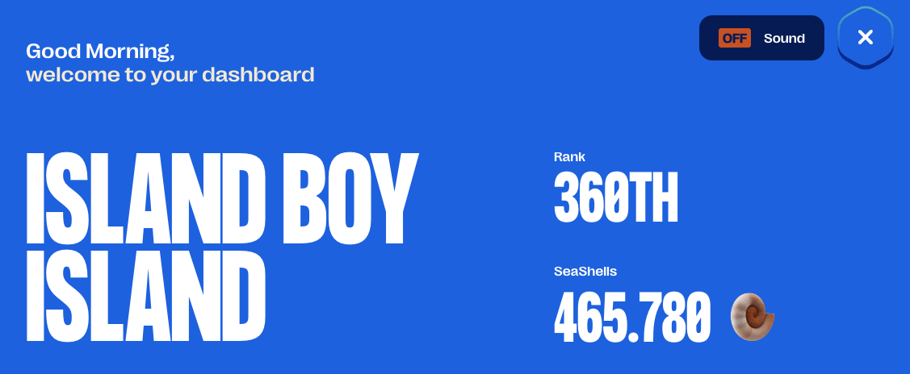

# Prosperity 3 by IMC: Team Island Boy Island

The IMC Prosperity3 challenge is a 15-day trading competition in a virtual market environment. Participants are tasked with building and optimising trading algorithms by backtesting their strategies on provided historical data. The challenge provides a simulated environment where participants can test and evaluate their models against others.

There is also a manual trading component to the challenge, in which game theory and the intuitive anticipation of actions of a large set of equally informed players were crucial to success. 

## The team and their contributions
[**Karin Nakanishi**](https://www.linkedin.com/in/karin-nakanishi/): Developed the utility functions and the structure of `Trader` class before the start of the competition; analysed trading signals and developed strategies for all assets except for the options; oversaw and merged the different strategies developed by team members for submission. 

[**Yannick Kohler**](your link): Implemented the algorithms used in the manual trading part; developed the options trading strategy.

[**your name**](your link): your contribution (e.g. developed strategy for product X in round X, developed all manual strategies, developed options strategy...)

Honourable mention: [**Jasper's backtester**](https://github.com/jmerle/imc-prosperity-3-backtester)

## Project Overview
This repository contains the code we used in the IMC Prosperity3 challenge.
In the `main` branch, you will find the final submission files (`roundn_final.py`), as well as the scripts used for calculating the manual trades (`Manualn.py`). 

In the `karin` branch, you will find my Jupyter notebooks, as well as the data and log files used for research.  Each team member's respective branch also contains the implementation of their trading strategies in Python.

<h3> 🛠 Utility Functions (utils.py) </h3>

There are several utility functions to analyse the log files generated by the Prosperity server:

- `get_prices_log`: Extracts price and PnL data from the end-of-round log files.
- `get_tradehistory`: Extracts trade history (both own and market trades) from log files and outputs the data as a pandas dataframe.
- `get_mytrades`: Extracts own trades from the dataframe returned by `get_tradehistory` for a specified product.
- `get_orderbook`: Extracts the orderbook at each timestep, provided that it’s printed correctly by the Trader class.

Additionally, there are some utility functions for backtesting and research:

- `get_midprice_mm`: Calculates the theoretical midprice corresponding to the prices quoted by the market-making bots placing large orders on both sides. This is inspired by the discovery made by Linear Utilities ([source](https://github.com/ericcccsliu/imc-prosperity-2)).
- `find_signal_..(zscore, momentum, breakout)`: Implements various strategies to identify trading signals based on statistical methods such as z-score, momentum, and breakout patterns.
- `find_spread`: Calculates the spread between the ETF and its synthetic (introduced in Round 2) using the size-weighted mid-price.

With this, we are ready to dive into the competition! 💹

<h3> 🤑 Trader class logic </h3>

- `update_open_pos`: At each timestep, check for new (own) trades, and add the new trades to the dictionaries corresponding to open buy and sell orders. We consider the orders "closed" if there is a profit of at least 1 unit. Used to track the prices at which the algo has previously bought or sold to keep the profits/losses in check. 

- `order_prod`: Implements the trading strategy for each product.

- `run`: First update open positions as described above, then place orders for each product. 

<h3> 🦑 Round 1 </h3>

<h4> Algorithmic trading </h4>

In Round 1, three products are traded in the exchange: RAINFOREST_RESIN, KELP and SQUID_INK. 

The fairprice of RAINFOREST_RESIN is constant at 10000 according to the market-making bots, but there is some noise around this value due to other bots placing orders below and above this price. Market-taking around this constant fairprice has worked very well, but we could further improve our PnL by market-making - placing bids below and asks above this price. We also cleared our positions by buying and selling at the fairprice when approaching the position limit. This has helped a little, but there was a trade-off between clearing too early (missing out on profitable trades) vs clearing too late (reaching and staying at the position limit for some time). With this, we could rake in a stable ~35k profit every round.

For KELP, we again calculated the fairprice as the one specified by the market-making bots. Market-taking and -making around this fairprice worked well. We also cleared our positions when it was beyond a certain limit, but made sure to impose a minimum profit of 1 unit against the outstanding orders. Even though the algo worked well, since the price fluctuations of KELP were small, the profit was stable but small, at around 5k every round. 

SQUID was highly volatile and had sudden, large spike/drop in prices. Based on the hint, we tried different mean-reversion approaches like Z-score and Ornstein-Uhlenbeck process, but found it difficult to correctly identify the signals. As a result, our profit from SQUID fluctuated quite a bit.

<h4> Manual trading </h4>

This round's manual trading challenge was about exploiting mispricings in the exchange rate of different assets. A total of five assets were given, which could be exchanged for one another at fixed exchange rates. In up to five trades, players aimed to maximise their starting capital and return to the original asset. We employed a dynamic programming algorithm with complexity O(k*n^2).
Unsurprisingly did we as well as many other teams found this deterministic best solution, and we were tied for first place with thousands of other teams.

<h3> 🧺 Round 2 </h3>

<h4> Algorithmic trading </h4>

In Round 2, the idea of ETF and synthetic was introduced. We could trade two PICNIC_BASKETs which corresponded to ETFs, as well as their contents CROISSANTS, JAMS and DJEMBES. As a first attempt, we tried to trade the spread between the basket and their underlying synthetic price, trading each spread independently. However, since the two baskets have similar contents and are highly correlated, we thought it made more sense to trade them together. Some research revealed that with a hedge ratio of ~2, the spread between the two baskets is much more mean-reverting than the individual spread. We thus switched to a pair-trading strategy in Round 5, hedging one basket with the other. This strategy turned out to work much better across different days in backtesting, raking in 20~30k of profit each day.

<h4> Manual trading </h4>

In the next manual trading challenge, players chose from containers with fixed payouts, split among all teams and "inhabitants" selecting the same one. Since choices were made simultaneously, anticipating others’ behaviour was key to avoiding overcrowded containers.

Each container’s payout was divided by the total of teams and inhabitants. A second prize pool option cost 50k—well above the average expected return of 34k—offering high risk and limited upside, so we avoided it.
With little insight into others’ choices, we preferred containers with larger payouts and good payout-to-inhabitant (P/I) ratios, avoiding outliers likely to attract too many teams. A linear regression on last year’s similar data ($R^2 = 0.85$) supported targeting mid-to-large containers with mid-to-high P/I ratios.
We chose the 800k/6-inhabitant container (P/I = 133.3k), within the range of 100k–182.5k and skewed toward the lower end. Our result landed us in the middle of the field. Interestingly, both top- and bottom-performing containers had small payouts and middling P/I ratios—-supporting our risk-averse approach favouring stable returns over high variance.

<h3> 🪨 Round 3 </h3>

<h4> Algorithmic trading </h4>

Round 3 was all about options. We could trade the products VOLCANIC_ROCK_COUPON_N corresponding to different strike prices N, as well as the underlying asset, VOLCANIC_ROCK. Our first approach was to simply price the options independently with Black-Scholes based on historic volatility (which was fairly constant). This approach did not work out since the implied volatilities that one gets from numerically inverting BS were substantially and systematically lower than the historical volatilities. We also noted that there was a very pronounced IV smile in the given training data. So we decided to change course and infer an IV curve, based on which we would then determine the volatility to be used in BS, which would give us the fair price prediction.

It turns out, the way IMC seemingly implemented their options pricing was that the IV smile didn't gradually change, but became step-wise sharper with each day. Since we saw the IV smile being constant over the full training set, we didn’t allow for any possible changes in shape over time, which in turn led to our model supposing vastly too high volatilities for options close to at-the-money and vastly too low volatilities for options deep out/in-the-money. This error in assumptions led to us basically going all-in on purchasing ATM options and selling OTM/ITM options right up to the position limits, which led to massive losses for us during that round.

We later corrected that by basing our IV estimate on a weighted average of the IV smile of previous timesteps, which gave our model the ability to adapt in a very flexible and responsive way to any possible change in shape or position of the volatility smile, while still not overfitting to previous mispricings.

<h4> Manual trading </h4>

In this round’s manual trade, we could place two bids between 160 and 320 to buy a good, which would then be sold at a fixed price of 320. Sellers with reserve prices below our bids would sell to us at our offered prices. Reserve prices were uniformly distributed in [160, 200] and [250, 320].
The first bid had no reason to be above 200, as prices between 200 and 250 reduced profit without increasing volume. The second bid, however, had to account for market dynamics—its effectiveness declined sharply if it fell below the average of all second bids.
We calculated the optimal strategy across all possible average second bids and found the second bid should be set at max(285, expected average). Sensitivity analysis showed profit dropped off more steeply when underestimating the average, so overestimating was safer.
Assuming others would also settle on 285, we bid slightly higher at 292 to avoid falling below average. This sacrificed a small portion of potential profit for greater downside protection.
The results showed that average bids were 201 and 286, validating our strategy. Most teams had similar logic, though many placed second bids between 200 and 285, which made no mathematical sense in any scenario.

<h3> 🍪 Round 4 </h3>

<h4> Algorithmic trading </h4>

The new product in Round 4 was MAGNIFICENT_MACARONS. Inspired by Prosperity 2, we investigated the arbitrage opportunities, which is to import from Pristine Cuisine at a cheaper price and sell them on the island exchange. However, unlike in Prosperity 2, there was now a conversion limit imposed, which heavily limited the volume. We only managed to produce around 5k profit with this simple arbitrage method. A much more important factor highlighted in the hint given by IMC seemed to be the sunlight index. We saw that a sharp change in the sunlight index when it is below a critical value of ~35 indicates a large drop in the macaron price. Therefore, we used this as a sell signal, and exited the short position once the sunlight index is back to above 45. 

<h4> Manual trading </h4>

Round 4 of manual trading followed a very similar format to Round 2, with the main change being an increased number of options. Any team could now participate in up to three prize pools (for 0, 50k, and 150k additional cost, respectively). With the new numbers, we calculated an average payoff of 57k, which is why we decided to go for two prize pools this time, using a similar decision process as before, under the assumption that there would be a significant influx towards the lower prize pools, in an anticipated repetition of the results from Round 2.

<h3> 🕵🏻‍♀️ Round 5 </h3>

<h4> Algorithmic trading </h4>

This was a very nice round. We obtained information about our counterparties. In particular, the data provided showed that Olivia consistently had the knowledge about the global minimum and maximum in a trading day, so we relied on her signal for SQUID_INK and CROISSANTS, only buying (selling) within a certain range from this global min (max). This had worked quite well, and Lady Olivia helped us gain ~18k with the two assets combined. She also traded KELP, but we found that since the price variation in KELP was not large, we could actually make more profit by market-making and taking instead of waiting for Olivia's signal. 

<h4> Manual trading </h4>

In this last manual trading round, we were supplied with a newsletter containing relevant news for nine companies, which weren’t yet priced in, and we were supposed to estimate the market reaction and trade accordingly. An additional difficulty was properly accounting for trading fees, as they increased exponentially with position size. We therefore implemented an algorithm that, for a given market scenario, would calculate the optimal response. The challenge was how to accurately estimate the market reaction. We chose an independent expert estimate approach, where all team members independently estimated the anticipated market move, which we then averaged and used as the basis for the market scenario fed into the model.
This round of manual trading again turned out to be fairly profitable.

All in all, it was a fun challenge and we learned a lot.
We had some technical issues in the earlier rounds leading to some unfortunate slippage, but we managed to end the competition with the rankings 7/49 in Switzerland and 360/12620 globally (top 3%)! 🎉🤑
